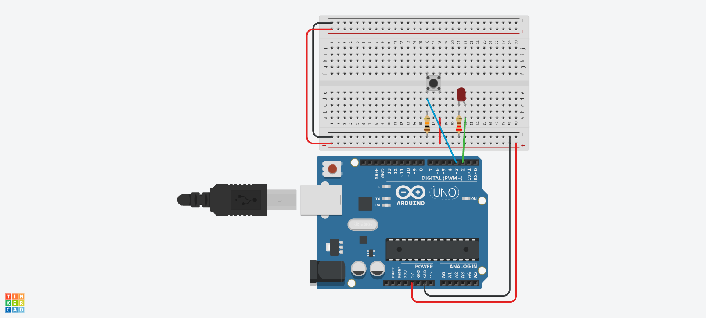

# 🔘 Lección 2: El Interruptor (Lectura Digital)

Hasta ahora el Arduino hablaba (Output), ahora va a escuchar (Input). Usaremos un botón para controlar el LED.

> **💡 Contexto Xplorer:** Los botones son fundamentales. En tu robot, un botón puede ser un "Bumper" (parachoques) que le avise si chocó contra una pared.

---

## 🎯 Objetivos de Aprendizaje

1.  **Hardware:** Configuración Pull-Down (evitar lecturas falsas).
2.  **Programación:** Uso de `digitalRead()` y condicionales `if / else`.
3.  **Lógica:** Estado binario (Presionado = 1, Suelto = 0).

## 🔌 Materiales y Conexión

* 1 x LED + Resistencia 220Ω
* 1 x Pulsador (Push Button)
* 1 x Resistencia 10kΩ (Marrón-Negro-Naranja)

### Diagrama de Conexión
* **LED:** Pin D2.
* **Botón:** Pin D3 (Con resistencia Pull-Down a GND).

---

## 💻 Explicación del Código

El Arduino pregunta constantemente: "¿El botón está presionado?".
* **`digitalRead(PIN)`**: Lee si entra voltaje (5V) o no (0V).
* **`if (condición) { ... }`**: Si la condición es verdadera, ejecuta la acción.

---

## 🤖 Asistente Docente (Prompt para IA)

Copia esto en Gemini para explicar la clase:

> "Hola Gemini, estamos viendo Entradas Digitales con un botón.
> 1. Explícame qué es una señal 'flotante' o 'ruido' y por qué necesitamos la resistencia pull-down (usa una analogía de una puerta batiente).
> 2. ¿Cómo modifico el código para que el botón funcione al revés (luz prendida siempre, y se apaga al presionar)?
> 3. Dame un ejemplo de la vida real donde se use esta lógica (ej. timbre de puerta)."

---

## 🚀 Reto para el Estudiante

**Misión:** "El Interruptor de Luz"
Actualmente, el LED solo prende *mientras* mantienes el dedo en el botón.
**Reto:** Modifica el código (usando variables) para que al tocar el botón una vez se quede encendido, y al tocarlo otra vez se apague. (Lógica de Toggle).

---

<b>Insani Robotics</b> - <i>Fundamentos</i>
