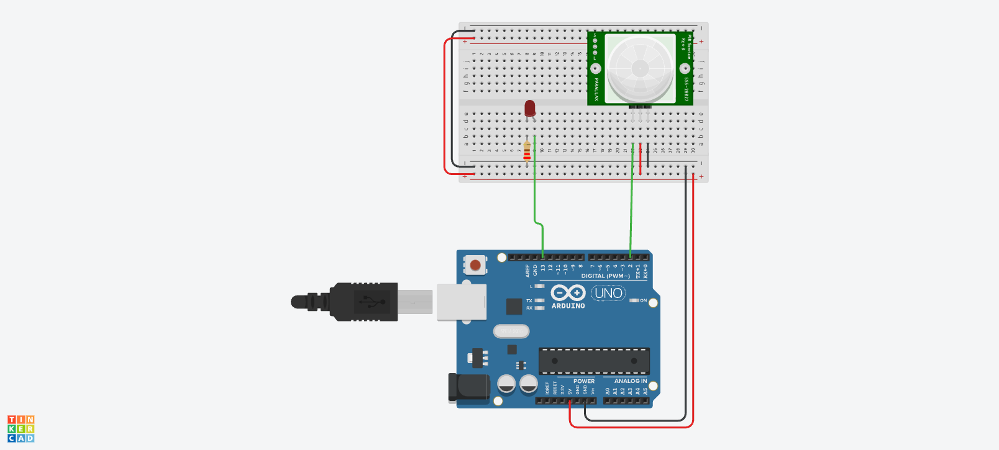

# 👁️ Lección 4: Sensor de Movimiento (PIR)

Vamos a usar un sensor real. El sensor PIR detecta el calor infrarrojo de los cuerpos en movimiento. Para Arduino, ¡funciona igual que un botón automático!

> **💡 Contexto Xplorer:** Este concepto es idéntico a cómo funcionan los sensores de línea o de obstáculos del robot: te dan un 1 (Hay algo) o un 0 (No hay nada).

---

## 🎯 Objetivos de Aprendizaje

1.  **Hardware:** Calibración y tiempo de espera del sensor HC-SR501.
2.  **Sensores:** Diferencia entre sensores digitales (PIR) y analógicos.
3.  **Aplicación:** Sistemas de alarmas.

## 🔌 Materiales y Conexión

* 1 x Arduino Nano
* 1 x Sensor PIR (HC-SR501)
* 1 x LED (Alarma visual)

### Diagrama de Conexión
* **VCC:** 5V
* **GND:** Tierra
* **OUT:** Pin D2
* **LED Alarma:** Pin D13

---

## 💻 Explicación del Código

El PIR necesita unos segundos al arrancar para "leer" el ambiente (calibración).
El código usa `digitalRead(PIN_SENSOR)`.
* **HIGH:** Alguien se movió.
* **LOW:** Todo está quieto.

---

## 🤖 Asistente Docente (Prompt para IA)

Copia esto en Gemini:

> "Hola Gemini, estoy usando un sensor PIR.
> 1. Explícale a mis alumnos cómo el sensor 've' el calor (radiación infrarroja) y por qué no detecta a un robot de juguete pero sí a una mano.
> 2. El sensor tiene dos perillas naranjas (potenciómetros). ¿Qué ajusta la 'Sensibilidad' y qué ajusta el 'Tiempo de Retardo'?
> 3. Crea una historia de misterio donde el protagonista tiene que burlar un sensor PIR."

---

## 🚀 Reto para el Estudiante

**Misión:** "Trampa Cazafantasmas"
Agrega el **Buzzer** (de la lección F1 de sonido, si ya la viste, o solo el LED) al código.
Haz que cuando el sensor detecte movimiento, la alarma suene intermitente por 5 segundos y luego se reinicie sola.

---

<b>Insani Robotics</b> - <i>Fundamentos</i>
