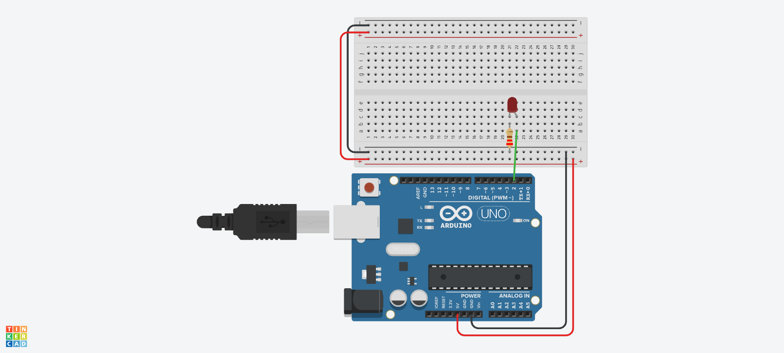
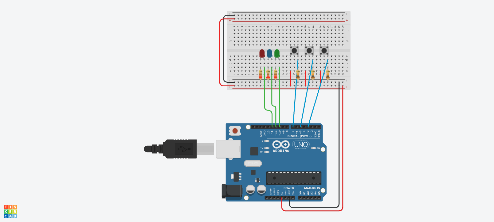

# 🟢 F1: Entradas y Salidas Digitales (Lógica Binaria)

En este módulo aprenderemos el lenguaje básico de las máquinas: **ON (Encendido/1/HIGH)** y **OFF (Apagado/0/LOW)**. Todo robot, por complejo que sea, toma decisiones basándose en estas señales digitales.

> **Objetivo:** Aprender a controlar LEDs y leer sensores digitales (botones y sensor de movimiento PIR).

---

## 🛠️ Materiales Necesarios para este Módulo
* 1 x Arduino Nano
* 1 x Protoboard
* 3 x LEDs (Rojo, Amarillo, Verde recomendados)
* 3 x Resistencias de 220Ω (Para los LEDs)
* 3 x Pulsadores (Push-buttons)
* 3 x Resistencias de 10kΩ (Para los botones - Configuración Pull-Down)
* 1 x Sensor de Movimiento PIR (HC-SR501)
* Cables Jumper

---

## 📘 Lección 1: Hola Mundo (Blink Externo)
**Archivo:** `01_Hola_Mundo.ino`

La práctica clásica. Encender y apagar un LED conectado a un pin digital.

### 🔌 Conexión
* **LED Pata Larga (+):** Al Pin **D2**.
* **LED Pata Corta (-):** A GND (pasando por resistencia 220Ω).

*(Sube tu imagen con este nombre: Conexion_F1_L1_Led.jpg)*

---

## 📘 Lección 2: El Interruptor (Botón)
**Archivo:** `02_El_Interruptor.ino`

Aprenderemos a usar `digitalRead()`. Si presiono el botón, el LED se enciende. Si lo suelto, se apaga.

### 🔌 Conexión
* **LED:** Pin D2.
* **Botón:** Pin **D3**. (Requiere resistencia de 10kΩ conectada a GND - Pull Down).

*(Sube tu imagen con este nombre: Conexion_F1_L2_Boton.png)*

---

## 📘 Lección 3: Consola de Control (3 LEDs + 3 Botones)
**Archivo:** `03_Consola_3Botones.ino`

Control independiente. Cada botón controla su propio LED. Ideal para entender la lógica de pines múltiples.

### 🔌 Conexión
* **LEDs:** Pines D2, D4, D6.
* **Botones:** Pines D3, D5, D7.

*(Sube tu imagen con este nombre: Conexion_F1_L3_Consola.jpg)*

---

## 📘 Lección 4: Sensor de Movimiento (PIR)
**Archivo:** `04_Sensor_PIR.ino`

El sensor PIR funciona igual que un botón para Arduino: nos envía un "1" (HIGH) cuando detecta movimiento y un "0" (LOW) cuando no.

### 🔌 Conexión
* **VCC:** A 5V del Arduino.
* **GND:** A GND del Arduino.
* **OUT (Señal):** Al Pin **D2**.
* **LED de Alarma:** Al Pin **D13** (O usar el integrado).

*(Sube tu imagen con este nombre: Conexion_F1_L4_PIR.jpg)*

---

## 🤖 Prompt para el Docente (Uso con IA)
Copia esto en Gemini para explicar el concepto de "Pull-Down":

> "Explícame la diferencia entre 'Ruido Eléctrico' y una señal limpia en Arduino. ¿Por qué necesitamos una resistencia 'Pull-Down' cuando usamos un botón? Usa una analogía con una puerta que el viento mueve si no tiene cerrojo."

---

<b>Insani Robotics</b>
