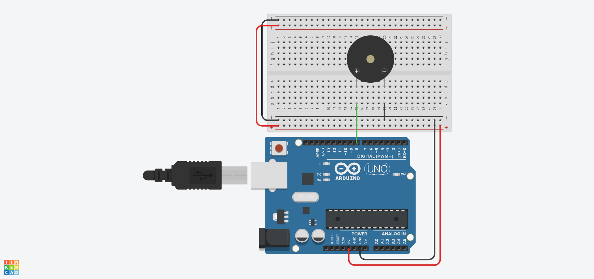

# 🔊 Fundamento 1: Generación de Sonido (Buzzer)

En este módulo aprenderemos a darle "voz" a nuestros proyectos. Usaremos un **Buzzer (Zumbador)** para generar tonos, alarmas y melodías.

> **💡 Contexto Xplorer:** En el futuro, este componente será el claxon de tu vehículo o la alarma de retroceso.

---

## 🎯 Objetivos de Aprendizaje

1.  **Hardware:** Entender la diferencia entre buzzer activo y pasivo (y polaridad).
2.  **Programación:** Dominar la función `tone()` y `noTone()`.
3.  **Física:** Comprender la relación entre Frecuencia (Hz) y notas musicales.

## 🔌 Materiales y Conexión

* 1 x Arduino Nano
* 1 x Buzzer (Piezoeléctrico)
* Cables Jumper

### Diagrama de Conexión
Conecta el terminal positivo (+) del buzzer al **Pin D8** y el negativo (-) a **GND**.

*(Asegúrate de copiar la imagen Conexion_1_Buzzer.jpg en esta carpeta)*

---

## 💻 Explicación del Código

El código utiliza la función nativa de Arduino `tone(pin, frecuencia, duración)`.

* **Frecuencia:** Es el tono del sonido. 261Hz es un DO, 440Hz es un LA.
* **Duración:** Cuántos milisegundos sonará.

---

## 🤖 Asistente Docente (Prompt para IA)

Copia y pega esto en tu chat con Gemini para preparar la clase:

> "Hola Gemini, estoy enseñando el módulo F1 (Buzzer) de Insani Robotics.
> El código usa la función tone() en el pin 8.
> 1. Explícame cómo funciona un material piezoeléctrico de forma sencilla para niños.
> 2. Genera una tabla con las frecuencias en Hz de la escala musical (Do, Re, Mi, Fa, Sol, La, Si) para que mis alumnos puedan componer una canción.
> 3. Dame una idea de juego donde el robot tenga que emitir sonidos diferentes según una emoción (triste, feliz, enojado)."

---

## 🚀 Reto para el Estudiante

**Misión:** "La Ambulancia"
Modifica el código para que el sonido alterne rápidamente entre dos frecuencias (ej. 400Hz y 800Hz) para simular la sirena de una ambulancia.

---

    <b>Insani Robotics</b> - <i>Fundamentos de Ingeniería</i>

