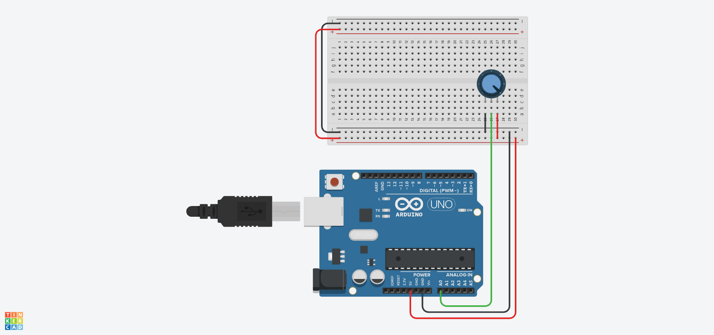

# 🎛️ Lección 1: El Potenciómetro (Lectura Analógica)

Bienvenido al mundo analógico. Hasta ahora, el Arduino solo veía "Blanco o Negro" (Encendido/Apagado). Hoy le enseñaremos a ver toda la escala de grises.

Usaremos un **Potenciómetro**, que es básicamente una resistencia que cambia cuando giras la perilla. Es el mismo componente que usas para subir el volumen de un radio antiguo.

> **💡 Contexto Xplorer:** En robótica avanzada, este mismo principio se usa para medir el ángulo de un brazo robótico o la posición de un volante.

---

## 🎯 Objetivos de Aprendizaje

1.  **Hardware:** Aprender a conectar componentes de 3 pines (VCC, GND y Señal).
2.  **Programación:** Dominar la función `analogRead()` y entender el **Monitor Serial**.
3.  **Concepto:** El Convertidor Analógico-Digital (ADC). Entender por qué 5 Voltios se convierten en el número 1023.

## 🔌 Materiales y Conexión

* 1 x Arduino Nano
* 1 x Potenciómetro (de 10kΩ o cualquier valor común)
* Cables Jumper

### Diagrama de Conexión
El potenciómetro tiene 3 patas. Las de los extremos son para la energía y la del centro es la señal.

* **Pata Izquierda:** A 5V (VCC)
* **Pata Derecha:** A GND (Tierra)
* **Pata Central:** Al Pin **A0** (Analógico 0)

[Image of arduino potentiometer connection diagram]

---

## 💻 Explicación del Código

El código hace dos cosas nuevas:
1.  **`analogRead(A0)`**: Lee el voltaje en el pin. Si hay 0V, lee 0. Si hay 5V, lee 1023. Si está a la mitad (2.5V), lee alrededor de 512.
2.  **`Serial.begin(9600)`**: Abre un canal de comunicación entre el Arduino y tu computadora para que puedas ver esos números en pantalla.

---

## 🤖 Asistente Docente (Prompt para IA)

Copia y pega esto en Gemini para profundizar:

> "Hola Gemini, estoy en la Lección F2-L1 (Potenciómetro).
> 1. Explícame la analogía del 'Grifo de Agua' para entender cómo funciona un potenciómetro (resistencia variable).
> 2. El Arduino me muestra valores de 0 a 1023. Si leo el valor '512', ¿cuántos voltios están entrando al pin? (Muéstrame el cálculo matemático).
> 3. ¿Qué pasaría si conecto la pata central a un pin digital (como el D2) en lugar del A0?"

---

## 🚀 Reto para el Estudiante

**Misión:** "La Caja Fuerte"
Gira el potenciómetro y observa los números en el Monitor Serial.
Trata de dejar la perilla exactamente en el número **500**.
¿Es difícil? ¿El número tiembla un poco? (Esto te enseñará sobre la precisión y el ruido eléctrico).

---

    <b>Insani Robotics</b> - <i>Fundamentos de Ingeniería</i>

