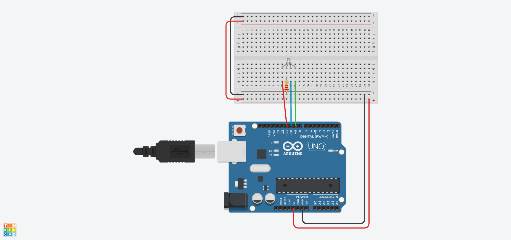

# 🎨 Lección 1: Colores Primarios (Mezcla Digital)

¿Alguna vez has mirado la pantalla de tu TV muy de cerca? Verás que cada punto de color en realidad son tres pequeñas luces: Roja, Verde y Azul.

En esta lección usaremos un **LED RGB**. Aunque parece un solo foco, por dentro tiene 3 LEDs diminutos que comparten una pata común (Tierra/GND). Al encender combinaciones de ellos, engañamos al ojo humano para que vea colores nuevos.

> **💡 Contexto Xplorer:** En tu robot, usaremos códigos de colores para "hablar" sin sonido:
> * **Verde:** Sistema listo / Batería llena.
> * **Rojo:** Error / Batería baja.
> * **Azul:** Esperando conexión Bluetooth.
> * **Magenta:** Modo de prueba.

---

## 🎯 Objetivos de Aprendizaje

1.  **Hardware:** Identificar el patillaje de un LED RGB de Cátodo Común (La pata más larga es GND).
2.  **Teoría del Color:** Comprender la **Síntesis Aditiva**.
    * Rojo + Verde = Amarillo 🟡 (¡Sí, luz amarilla!)
    * Rojo + Azul = Magenta 🟣
    * Verde + Azul = Cyan 💧
3.  **Programación:** Controlar múltiples salidas digitales en secuencia.

## 🔌 Materiales y Conexión

* 1 x Arduino Nano
* 1 x LED RGB (4 patas)
* **3 x Resistencias** (220Ω o 330Ω) - *¡OJO! Necesitas una para cada color.*

### Diagrama de Conexión
El LED RGB tiene 4 patas. La más larga es la segunda.
1.  **Pata 1 (Roja):** Al Pin **D11** (con resistencia).
2.  **Pata 2 (Larga/GND):** A **GND** (directo, sin resistencia).
3.  **Pata 3 (Azul):** Al Pin **D10** (con resistencia).
4.  **Pata 4 (Verde):** Al Pin **D9** (con resistencia).

*(Nota: El orden Rojo/Verde/Azul puede variar según el fabricante del LED. Si al probarlo sale un color equivocado, solo intercambia los cables).*

---

## 💻 Explicación del Código

Usamos una **Función Personalizada** llamada `establecerColor()`.
En lugar de escribir 3 veces `digitalWrite` o `analogWrite` cada vez que queremos cambiar de color, creamos nuestra propia instrucción que acepta 3 números (R, G, B).

* **255:** Brillo Máximo.
* **0:** Apagado.

---

## 🤖 Asistente Docente (Prompt para IA)

Copia esto en Gemini para profundizar:

> "Hola Gemini, estamos viendo la mezcla de colores luz (RGB).
> 1. Explícame por qué si mezclo pintura Roja y Verde sale marrón, pero si mezclo luz Roja y Verde sale Amarillo. (Diferencia entre Síntesis Sustractiva y Aditiva).
> 2. En el código usamos los valores (255, 255, 255) para el Blanco. ¿Qué pasaría si pongo (100, 100, 100)? ¿Seguiría siendo blanco?
> 3. Genera una lista de 5 colores 'exóticos' (como Naranja, Turquesa, Violeta) con sus códigos RGB aproximados para que los probemos."

---

## 🚀 Reto para el Estudiante

**Misión:** "La Sirena de Policía"
Crea un efecto de luces de policía.
Haz que el LED parpadee rápidamente alternando entre **ROJO** y **AZUL** (sin pasar por otros colores), simulando una patrulla. Juega con el `delay` para hacerlo más realista (ej. 100ms).

---

    <b>Insani Robotics</b> - <i>Fundamentos de Ingeniería</i>

