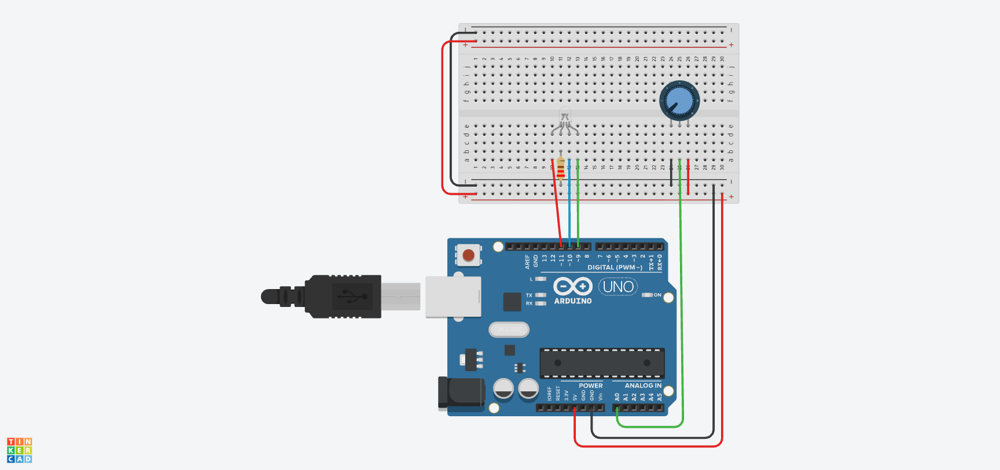

# 🎨 Lección 2: Mezclador de Color (Potenciómetro)

En la lección anterior aprendimos que Rojo + Azul = Magenta. Pero, ¿y si queremos un violeta más azulado? ¿O un rosa pálido?

No todo es 0 o 255. En esta lección usaremos un potenciómetro para crear una **transición suave (gradiente)** entre dos colores, observando cómo se mezclan en tiempo real.

> **💡 Contexto Xplorer:** En el tablero de instrumentos de un carro moderno, puedes girar una perilla para cambiar el color de la iluminación ambiental. ¡Vamos a replicar eso!

---

## 🎯 Objetivos de Aprendizaje

1.  **Lógica:** Relacionar una entrada variable (0-1023) con múltiples salidas inversas.
2.  **Matemáticas:** Entender la proporción inversa (mientras uno sube, el otro baja).
3.  **Creatividad:** Explorar gamas de colores personalizados.

## 🔌 Materiales y Conexión

Necesitamos combinar el circuito del LED RGB con el del Potenciómetro.

* 1 x Arduino Nano
* 1 x LED RGB (Con sus 3 resistencias).
* 1 x Potenciómetro.

### Diagrama de Conexión
1.  **LED RGB:** Pines D11 (R), D9 (G), D10 (B). (Igual que L1).
2.  **Potenciómetro:** Pin Central al **A0**. (Igual que F2).

---

## 💻 Explicación del Código

Vamos a crear un efecto de "Balanza":
* Cuando el potenciómetro está a la izquierda (0): El LED será 100% **ROJO**.
* Cuando el potenciómetro está a la derecha (1023): El LED será 100% **AZUL**.
* En el centro: Será una mezcla perfecta (**MAGENTA**).

**El Truco Matemático:**
Usaremos `map()` para calcular el Azul, y restaremos para calcular el Rojo.

---

## 🤖 Asistente Docente (Prompt para IA)

Copia esto en Gemini para explicar la clase:

> "Hola Gemini, estamos mezclando colores con Arduino.
> 1. Explica el concepto de 'Gradiente' o 'Degradado' de color.
> 2. En el código, el valor del Rojo es `255 - valorAzul`. Explica esta lógica matemática de 'sube y baja' (Relación Inversamente Proporcional) con una analogía de dos cubos de agua.
> 3. ¿Cómo modificaría el código para que la transición fuera entre Verde y Rojo en lugar de Rojo y Azul?"

---

## 🚀 Reto para el Estudiante

**Misión:** "El Semáforo Manual"
Modifica el código para usar **condicionales** (`if / else if`) en lugar de mezcla suave.
* Si el potenciómetro está bajo (0-300) -> Enciende **VERDE**.
* Si está en el medio (301-700) -> Enciende **AMARILLO** (Rojo + Verde).
* Si está alto (701-1023) -> Enciende **ROJO**.

---

    <b>Insani Robotics</b> - <i>Fundamentos de Ingeniería</i>

