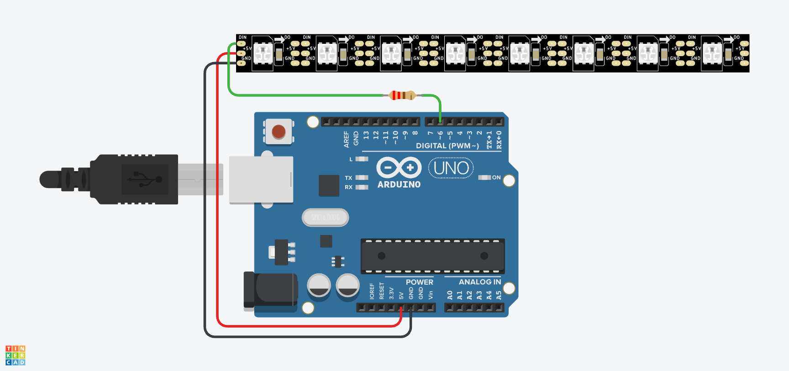

# 💫 Lección 1: Hola Neopixel (Tu primer Píxel)

Bienvenido a la iluminación moderna. A diferencia de un LED normal que solo se prende o apaga, un **Neopixel** es un pequeño robot de luz.

Cada LED tiene un chip cerebro diminuto. Para hablar con él, necesitamos un "traductor". En programación, a estos traductores les llamamos **Librerías**.

> **💡 Contexto Xplorer:** Las luces de policía, los efectos de "turbo" o los ojos del robot se hacen con esta tecnología.

---

## 🎯 Objetivos de Aprendizaje

1.  **Software:** Aprender a instalar la librería `Adafruit_NeoPixel` en Arduino IDE.
2.  **Concepto:** Entender la diferencia entre `setPixelColor` (Preparar el color) y `show` (Mostrarlo).
3.  **Coordenadas:** Entender que en programación, el primer LED no es el 1, es el **0**.

## ⚙️ Requisito Previo: Instalar Librería

**¡STOP! 🛑** Antes de cargar el código, debes hacer esto:
1.  Ve a `Herramientas` -> `Gestionar Bibliotecas` (o presiona `Ctrl+Shift+I`).
2.  Busca: **Adafruit NeoPixel**.
3.  Dale clic a **Instalar**.

---

## 🔌 Materiales y Conexión

* 1 x Arduino Nano
* 1 x Tira Neopixel (o un solo LED suelto).
* 1 x Resistencia de **220Ω a 470Ω** (¡Muy importante para proteger el primer pixel!).

### Diagrama de Conexión
Las tiras tienen dirección. Busca la flecha que dice **DIN** (Data In).
* **5V / VCC:** a 5V del Arduino.
* **GND:** a GND del Arduino.
* **DIN (Datos):** al Pin **D6** (Pasando por la resistencia).

[Image of arduino neopixel wiring diagram]

---

## 💻 Explicación del Código

El código tiene 3 pasos clave:
1.  **`tira.begin()`**: Prepara el pin de datos.
2.  **`tira.setPixelColor(n, rojo, verde, azul)`**: "Pinta" el pixel número `n` en la memoria del Arduino, **pero no lo enciende todavía**.
3.  **`tira.show()`**: ¡Acción! Envía los datos por el cable y los LEDs se encienden.
    * *Analogía:* Es como escribir una carta (`setPixelColor`) y luego echarla al buzón (`show`). Si no la echas al buzón, nadie la lee.

---

## 🤖 Asistente Docente (Prompt para IA)

Copia esto en Gemini:

> "Hola Gemini, estoy enseñando Neopixels.
> 1. ¿Por qué necesitamos la orden `tira.show()`? ¿Por qué los LEDs no se prenden inmediatamente cuando pongo `setPixelColor`? (Explica el concepto de Buffer de memoria).
> 2. En computación, empezamos a contar desde 0. Si tengo una tira de 10 LEDs, ¿cuál es el número del último LED? (¿10 o 9?).
> 3. ¿Qué es una 'Librería' en programación y por qué nos ahorra tiempo?"

---

## 🚀 Reto para el Estudiante

**Misión:** "El Semáforo de un Píxel"
El código actual enciende el Píxel 0 en Rojo.
Modifica el `loop` para que el MISMO píxel cambie de color cada segundo: Rojo -> Amarillo -> Verde -> Rojo...

---

    <b>Insani Robotics</b> - <i>Fundamentos de Ingeniería</i>

