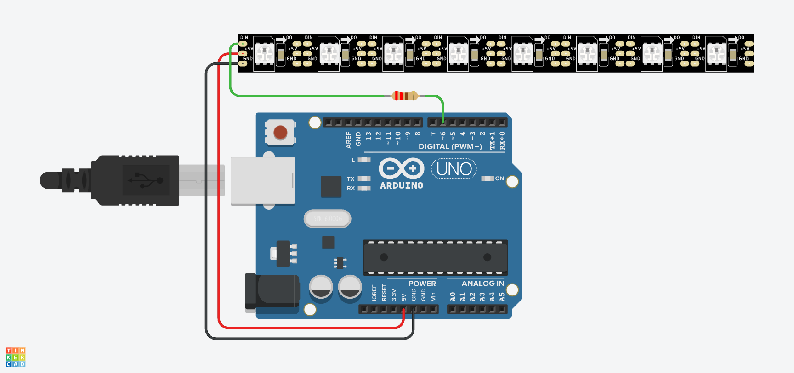

# 🌈 Lección 2: Control de Tira Completa (Bucles)

Imagina que tienes una tira de 100 LEDs. ¿Escribirías 100 veces la instrucción para encender cada uno? ¡Sería una locura y tardarías horas!

En esta lección aprenderemos a usar el **Bucle `for`** para recorrer la tira led por led, pintándolos uno a uno muy rápido. Esto crea el efecto básico de "barrido" o "wipe".

> **💡 Contexto Xplorer:** Cuando el robot arranca, puede hacer un efecto de "llenado" en su barra de luces para mostrar que sus sistemas están cargando al 100% (Loading Bar).

---

## 🎯 Objetivos de Aprendizaje

1.  **Algoritmos:** Usar un bucle `for` para recorrer un **Array** (la tira de LEDs es, en esencia, una lista ordenada de luces).
2.  **Lógica:** Entender la variable contadora `i` como el "dedo" que señala qué LED se va a encender en cada momento.
3.  **Efectos Visuales:** Crear animaciones básicas de barrido (Color Wipe).

## 🔌 Materiales y Conexión

* 1 x Arduino Nano
* 1 x Tira Neopixel (Mínimo 4 LEDs).
* 1 x Resistencia 220Ω - 470Ω.

### Diagrama de Conexión
Es idéntica a la Lección 1. Los datos viajan por el mismo cable único y se empujan de un LED al siguiente.

* **DIN (Datos):** Pin **D6**.
* **VCC:** 5V (o Fuente Externa si son muchos LEDs).
* **GND:** GND.

---

## 💻 Explicación del Código

La magia ocurre gracias al bucle `for`. Observa cómo funciona:

    // "i" es nuestro contador. Empieza en 0.
    // Mientras "i" sea menor que el número total de LEDs...
    // Sumamos 1 a "i" en cada vuelta.
    
    for(int i = 0; i < NUM_LEDS; i++) {
        tira.setPixelColor(i, 255, 0, 0); // Pinta el LED "i" de Rojo
        tira.show();      // Muestra el cambio
        delay(50);        // Espera un poco para ver el movimiento
    }

1.  **`int i = 0`**: Empezamos apuntando al primer LED.
2.  **`i < NUM_LEDS`**: Repetimos esto mientras no hayamos llegado al final de la tira.
3.  **`tira.show()` dentro del bucle**: Esto hace que veamos encenderse los LEDs uno por uno (animación). Si pusiéramos el `show()` fuera del bucle, se encenderían todos de golpe al final.

---

## 🤖 Asistente Docente (Prompt para IA)

Copia esto en Gemini para explicar la clase:

> "Hola Gemini, estoy enseñando bucles con LEDs.
> 1. Usa la analogía de 'Pintar una cerca tabla por tabla' para explicarle a un niño de 12 años cómo funciona el bucle `for` en este código.
> 2. ¿Qué pasa visualmente si cambio la condición `i++` (sumar 1) por `i = i + 2` dentro del bucle? ¿Qué patrón veríamos en la tira?
> 3. Explica por qué si tengo 8 LEDs, el bucle debe detenerse cuando 'i' llega a 8 (recordando que los índices son 0,1,2,3,4,5,6,7)."

---

## 🚀 Reto para el Estudiante

**Misión:** "Llenado Bicolor"
Modifica el código para que la tira se llene de dos colores distintos automáticamente:
* Si el LED es un número par (0, 2, 4...), píntalo de **AZUL**.
* Si el LED es impar (1, 3, 5...), píntalo de **ROJO**.
*(Pista: Usa el operador módulo `%` o un `if` sencillo).*

---

    <b>Insani Robotics</b> - <i>Fundamentos de Ingeniería</i>

