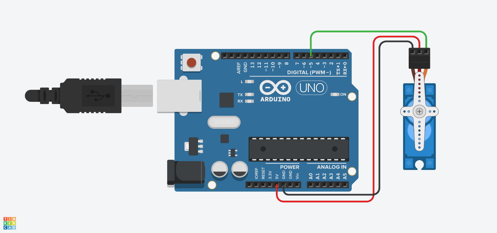

# 🦾 Lección 1: Barrido Automático (Sweep)

Un motor normal gira sin parar (como un ventilador). Un **Servomotor** es diferente: es un motor inteligente que sabe dónde está. Tú le dices *"Ve a 90 grados"* y él va y se queda quieto ahí.

En esta lección haremos el ejercicio clásico de "Limpiaparabrisas": mover el eje de un extremo a otro suavemente.

> **💡 Contexto Xplorer:** Este es el código exacto que usa el robot Xplorer para mover su "cabeza" (el sensor de ultrasonido) de izquierda a derecha para escanear el entorno buscando obstáculos.

---

## 🎯 Objetivos de Aprendizaje

1.  **Librerías:** Aprender a incluir y usar `<Servo.h>`.
2.  **Hardware:** Identificar los cables de un servo (Tierra, Potencia, Señal).
3.  **Lógica:** Usar bucles `for` para controlar la velocidad del movimiento angular.

## 🔌 Materiales y Conexión

* 1 x Arduino Nano
* 1 x Micro Servo (SG90 azul o similar).
* Cables Jumper Macho-Macho.

### ⚠️ Diagrama de Conexión
Los colores de los cables del servo pueden variar, pero el orden suele ser:

* **Marrón o Negro (GND):** a GND del Arduino.
* **Rojo (VCC):** a 5V del Arduino.
* **Naranja o Amarillo (Señal):** al Pin **D5**.

[Image of arduino servo motor wiring diagram]

---

## 💻 Explicación del Código

Para usar servos, Arduino nos facilita la vida con una **Clase** especial:
1.  **`Servo miServo;`**: Creamos un objeto (le ponemos nombre al motor).
2.  **`miServo.attach(PIN);`**: Le decimos dónde está conectado.
3.  **`miServo.write(GRADOS);`**: Le ordenamos moverse (0 a 180).

---

## 🤖 Asistente Docente (Prompt para IA)

Copia esto en Gemini para explicar la clase:

> "Hola Gemini, estoy enseñando Servomotores.
> 1. Explícale a mis alumnos qué hay dentro de la cajita azul del servo (un motor DC, engranajes y un potenciómetro). ¿Cómo sabe el servo en qué ángulo está?
> 2. En el código usamos `delay(15)`. ¿Qué pasa si cambio ese número a `delay(50)`? ¿El servo tendrá más fuerza o solo irá más lento?
> 3. ¿Por qué el rango es de 0 a 180 y no de 0 a 360 como una rueda normal?"

---

## 🚀 Reto para el Estudiante

**Misión:** "La Barrera de Peaje"
Un peaje no se mueve lento como un limpiaparabrisas. Se abre rápido y se cierra rápido.
**Reto:** Elimina los bucles `for`. Haz que el servo:
1.  Se ponga en 0 grados (Cerrado).
2.  Espere 2 segundos.
3.  Salte inmediatamente a 90 grados (Abierto).
4.  Espere 3 segundos.
5.  Vuelva a 0 grados.

---

    <b>Insani Robotics</b> - <i>Fundamentos de Ingeniería</i>

