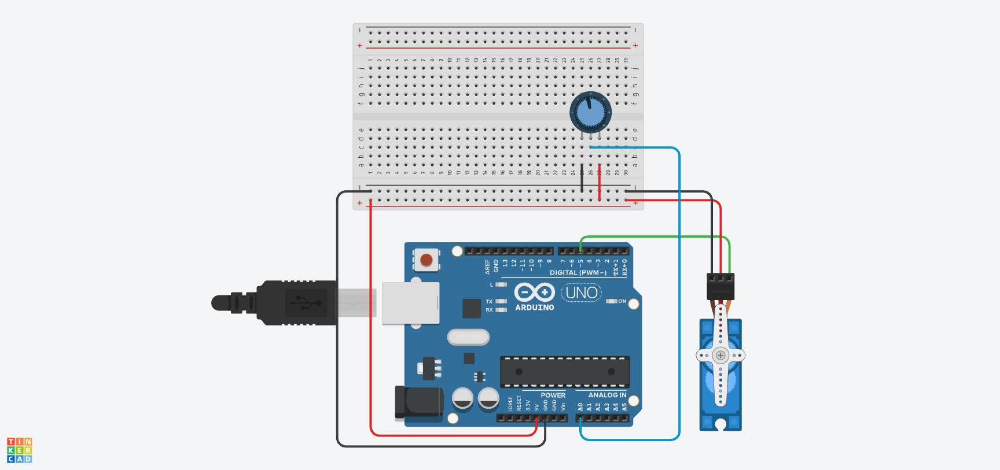

# 🎛️ Lección 2: Control Manual (Knob)

En la lección anterior, el servo se movía solo. Ahora, **tú tienes el control**.

Vamos a conectar un **Potenciómetro** (como el volumen de un radio) para controlar la posición exacta del motor. Si giras la perilla a la mitad, el motor irá a 90 grados. Si la giras al máximo, irá a 180.

> **💡 Contexto Xplorer:** ¿Has visto los controles remotos de los drones o los brazos robóticos industriales? Usan palancas (Joysticks) que funcionan exactamente igual que este potenciómetro.

---

## 🎯 Objetivos de Aprendizaje

1.  **Integración:** Unir una Entrada Analógica (F2) con una Salida de Servo (F5).
2.  **Matemáticas:** Volver a usar la función `map()` para traducir dos idiomas diferentes.
    * El Potenciómetro habla de 0 a 1023.
    * El Servo solo entiende de 0 a 180.
3.  **Control:** Entender la respuesta en tiempo real.

## 🔌 Materiales y Conexión

* 1 x Arduino Nano
* 1 x Micro Servo.
* 1 x Potenciómetro.

### Diagrama de Conexión
Combinamos dos circuitos que ya conoces:

1.  **Servo:**
    * Señal (Naranja) -> Pin **D5**.
    * VCC -> 5V.
    * GND -> GND.
2.  **Potenciómetro:**
    * Pata 1 -> 5V.
    * Pata 3 -> GND.
    * Pata Central (Señal) -> Pin **A0**.

---

## 💻 Explicación del Código

El reto es de traducción.
Si le enviamos la lectura directa del potenciómetro (ej. 1023) al servo, este no sabrá qué hacer, porque su máximo es 180.

Usamos: `int angulo = map(lectura, 0, 1023, 0, 180);`

---

## 🤖 Asistente Docente (Prompt para IA)

Copia esto en Gemini para explicar la clase:

> "Hola Gemini, estamos controlando un servo con un potenciómetro.
> 1. A veces el servo 'tiembla' un poco aunque yo no toque el potenciómetro. Explícame qué es el 'Ruido Eléctrico' y cómo afecta a las lecturas analógicas.
> 2. ¿Qué es un 'Grado de Libertad' (DOF) en robótica?
> 3. Si quisiera controlar la velocidad del servo en lugar de su posición, ¿cómo cambiaría la lógica?"

---

## 🚀 Reto para el Estudiante

**Misión:** "El Medidor de Fuerza"
Imagina que el servo es la aguja de un medidor de presión.
Dibuja en un papel un arco con marcas: "Vacío" (0°), "Medio" (90°) y "Lleno" (180°). Pégalo al servo y usa el potenciómetro para calibrar tu medidor.

---

    <b>Insani Robotics</b> - <i>Fundamentos de Ingeniería</i>

