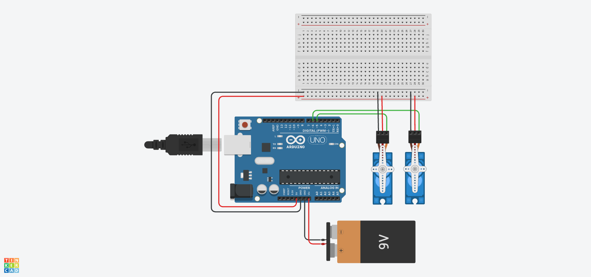

# 🦾 Lección 3: Multi-Servos (Coordinación Robótica)

Un robot útil raramente tiene un solo motor. Un brazo robótico básico tiene al menos 3 o 4 (Base, Hombro, Codo, Pinza).

El problema es: ¿Cómo le decimos a Arduino que mueva el "Codo" sin mover la "Base"? ¿O que mueva los dos al mismo tiempo en direcciones opuestas?

En esta lección aprenderemos a gestionar **múltiples objetos Servo** en el mismo código.

> **💡 Contexto Xplorer:** Aunque el Xplorer V1 usa un solo servo para la cabeza, los futuros kits (como el Brazo Robótico Insani) usarán este código base para controlar 4 ejes.

---

## 🎯 Objetivos de Aprendizaje

1.  **Programación Orientada a Objetos (Básico):** Crear múltiples instancias (`servo1`, `servo2`...).
2.  **Coreografía:** Programar movimientos sincronizados (mientras uno sube, el otro baja).
3.  **Gestión de Energía:** Entender por qué muchos motores requieren baterías externas.

## 🔌 Materiales y Conexión

* 1 x Arduino Nano.
* **2 x Micro Servos** (SG90).
* Fuente Externa (Recomendada) o Portapilas.

### Diagrama de Conexión
* **Servo 1 (Base):** Pin **D5**.
* **Servo 2 (Codo):** Pin **D6**.
* **VCC y GND:** ¡Cuidado! Si usas fuente externa, conecta el (-) de la batería al GND del Arduino para que compartan la referencia (Tierra Común).

---

## 💻 Explicación del Código

Arduino trata a cada servo como un "Objeto" independiente.
1.  Declaramos: `Servo base;` y `Servo codo;`.
2.  Configuramos: `base.attach(5);` y `codo.attach(6);`.
3.  Movemos: Podemos escribir `base.write(90)` y `codo.write(0)` en la misma línea de tiempo.

**El Desafío:** Si usamos `delay()`, el procesador se congela. Para movimientos fluidos simultáneos avanzados, se usa `millis()`, pero hoy empezaremos con movimientos secuenciales y opuestos simples.

---

## 🤖 Asistente Docente (Prompt para IA)

Copia esto en Gemini:

> "Hola Gemini, quiero construir un brazo robótico de 4 grados de libertad (DOF).
> 1. Explícame cómo conectar una fuente de baterías externa a los servos y al Arduino compartiendo la 'Tierra Común' (Common Ground). ¿Qué pasa si no conecto las tierras juntas?
> 2. Ayúdame a generar un código usando 'Arrays' para controlar 4 servos a la vez, para no tener que escribir 4 variables separadas.
> 3. ¿Qué es la cinemática inversa (Inverse Kinematics) y por qué es difícil de programar?"

---

## 🚀 Reto para el Estudiante

**Misión:** "El Saludo Militar"
Coloca los dos servos pegados con cinta para simular un brazo (Hombro y Codo).
Programalos para que realicen un saludo:
1.  Hombro sube a 90°.
2.  Codo se flexiona a 45° y vuelve a 0° tres veces rápido (el saludo).
3.  Hombro baja a 0° (descanso).

---

    <b>Insani Robotics</b> - <i>Fundamentos de Ingeniería</i>

