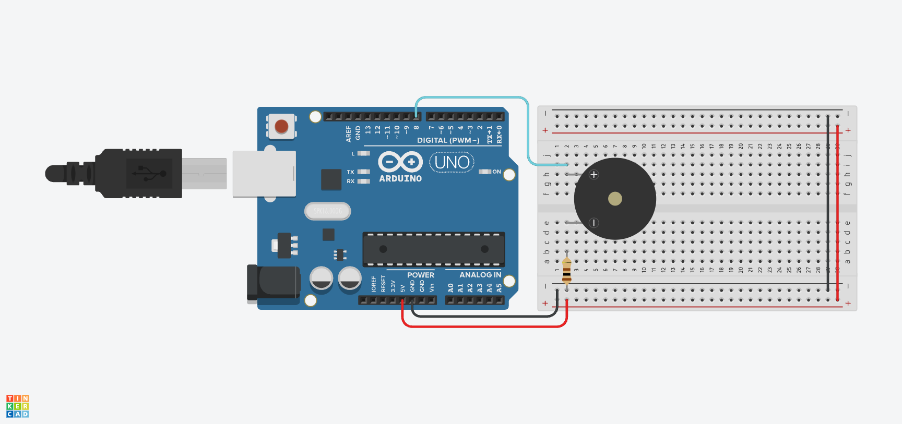

# 🎼 Lección 2: Reproductor de Melodías (Arrays)

Si quieres tocar una canción completa, escribir 100 veces la función `tone()` y `delay()` es aburrido, desordenado y difícil de corregir.

Los programadores inteligentes usan **Arrays** (Arreglos o Listas). Imagina que guardas toda la partitura en una lista ordenada y luego le dices al Arduino: *"Lee la lista nota por nota y tócalas"*.

> **💡 Contexto Xplorer:** Así es como guardamos sonidos complejos como la "Marcha Imperial" o el tema de "Mario Bros" en la memoria del robot para que suenen cuando se enciende.

---

## 🎯 Objetivos de Aprendizaje

1.  **Estructuras de Datos:** Entender qué es un Array: `int melodia[] = { ... }`.
2.  **Bucles y Arrays:** Usar un bucle `for` para recorrer la lista desde la posición 0 hasta el final.
3.  **Ritmo:** Entender que la música tiene dos componentes: **Frecuencia** (Qué nota es) y **Duración** (Cuánto tiempo suena).

## 🔌 Materiales y Conexión

* 1 x Arduino Nano
* 1 x Resistor de 100 ohms
* 1 x Buzzer (Pin D8).

### Diagrama de Conexión
Es idéntica a la lección anterior.
* **Buzzer (+):** Pin **D8**.
* **Buzzer (-):** GND.

---

## 💻 Explicación del Código

Tenemos dos listas (Arrays):
1.  **`melodia[]`**: Contiene las frecuencias (Do, Sol, La...).
2.  **`duraciones[]`**: Contiene el tiempo de cada nota (4 = negra, 8 = corchea).

El bucle hace esto:

    for (int i = 0; i < numeroNotas; i++) {
        // 1. Calcula cuánto dura la nota en milisegundos
        // (1000 / 4 = 250ms, 1000 / 8 = 125ms)
        int duracion = 1000 / duraciones[i];
        
        // 2. Toca la nota de la posición 'i'
        tone(8, melodia[i], duracion);
        
        // 3. Hace una pequeña pausa para separar las notas
        delay(duracion * 1.30);
    }

---

## 💾 Código Fuente: `02_Melodia_StarWars.ino`

    /*
     * INSANI ROBOTICS - FUNDAMENTOS F6
     * Lección 2: Melodía con Arrays (Star Wars Intro)
     * ------------------------------------------------
     * Objetivo: Usar Arrays para secuenciar música.
     * Pin: D8
     */

    const int PIN_BUZZER = 8;

    // --- DEFINICIÓN DE NOTAS ---
    #define NOTE_C4  262
    #define NOTE_D4  294
    #define NOTE_E4  330
    #define NOTE_F4  349
    #define NOTE_G4  392
    #define NOTE_A4  440
    #define NOTE_C5  523

    // --- ARRAY 1: LA PARTITURA (Notas) ---
    // Lista ordenada de frecuencias
    int melodia[] = {
      NOTE_C4, NOTE_G4, NOTE_F4, NOTE_E4, NOTE_D4, NOTE_C5, NOTE_G4,
      NOTE_F4, NOTE_E4, NOTE_D4, NOTE_C5, NOTE_G4, NOTE_F4, NOTE_E4, NOTE_F4, NOTE_D4
    };

    // --- ARRAY 2: LOS TIEMPOS (Ritmo) ---
    // 4 = Negra, 8 = Corchea, etc.
    // DEBE tener la misma cantidad de elementos que la melodía.
    int duraciones[] = {
      2, 2, 8, 8, 8, 2, 4,
      8, 8, 8, 2, 4, 8, 8, 8, 2
    };

    void setup() {
      pinMode(PIN_BUZZER, OUTPUT);
    }

    void loop() {
      // Calculamos automáticamente cuántas notas hay
      int numeroNotas = sizeof(melodia) / sizeof(int);

      for (int i = 0; i < numeroNotas; i++) {

        // 1. Calcular duración en ms
        int duracionNota = 1000 / duraciones[i];
        
        // 2. Tocar nota
        tone(PIN_BUZZER, melodia[i], duracionNota);

        // 3. Pausa entre notas (para que no suene "pegado")
        int pausa = duracionNota * 1.30;
        delay(pausa);
        
        // 4. Detener vibración
        noTone(PIN_BUZZER);
      }
      
      delay(3000); // Esperar 3 segundos antes de repetir
    }

---

## 🤖 Asistente Docente (Prompt para IA)

Copia esto en Gemini:

> "Hola Gemini.
> 1. Explica qué es un 'Array' usando la analogía de un pastillero semanal (Lunes, Martes, Miércoles...).
> 2. Si cambio un número en el array `duraciones[]` de 4 a 8, ¿la canción irá más rápido o más lento en esa nota?
> 3. Ayúdame a traducir una canción simple (como 'Estrellita dónde estás') a formato de array para Arduino."

---

## 🚀 Reto para el Estudiante

**Misión:** "DJ Robótico"
Busca en Google: *"Arduino melody Mario Bros code"*.
Encontrarás códigos con cientos de líneas. Tu misión es copiar SOLO los arrays de notas y tiempos de ese código y reemplazarlos en el tuyo para cambiar la canción.

---

    <b>Insani Robotics</b> - <i>Fundamentos de Ingeniería</i>

