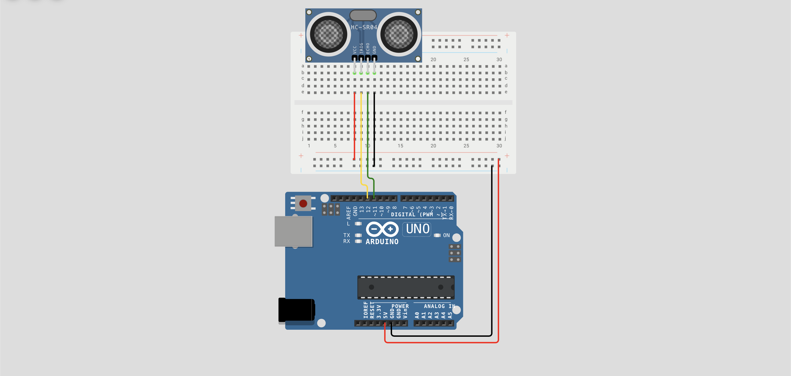

# 📏 Lección 1: Metro Digital (HC-SR04)

El sensor ultrasónico funciona enviando un pulso de sonido (Ping) y esperando a que rebote (Pong).

Arduino es capaz de medir el tiempo que tarda ese sonido en volver con una precisión de **microsegundos** (millonésimas de segundo). Conociendo la velocidad del sonido, podemos calcular la distancia exacta.

> **💡 Contexto Xplorer:** Antes de que el robot decida si frenar o girar, necesita este dato: `¿Cuántos centímetros faltan para el choque?`.

---

## 🎯 Objetivos de Aprendizaje

1.  **Física:** Aplicar la fórmula $Distancia = \frac{Tiempo \times Velocidad}{2}$.
2.  **Programación:** Entender la función `pulseIn()`.
3.  **Hardware:** Conectar un sensor de 4 pines (Trig/Echo).

## 🔌 Materiales y Conexión

* 1 x Arduino Nano
* 1 x Sensor HC-SR04

### Diagrama de Conexión
El sensor tiene 4 pines.
* **VCC:** a 5V.
* **GND:** a GND.
* **Trig (Gatillo):** al Pin **D12** (Salida: Arduino grita).
* **Echo (Eco):** al Pin **D11** (Entrada: Arduino escucha).

---

## 💻 Explicación del Código

El proceso tiene 3 pasos que se repiten muy rápido:

1.  **Disparo (Trigger):** Enviamos un pulso de 10 microsegundos por el pin Trig para iniciar el sonido.
2.  **Escucha (Echo):** Usamos `pulseIn(Echo, HIGH)`. Esta función espera y cuenta el tiempo hasta que recibe el rebote.
3.  **Cálculo:**
    * Velocidad del sonido = 343 m/s = **0.0343 cm/µs**.
    * Fórmula: `distancia = tiempo * 0.0343 / 2`.

---

## 💾 Código Fuente: `01_Metro_Basico.ino`

    /*
     * INSANI ROBOTICS - FUNDAMENTOS F7
     * Lección 1: Medidor de Distancia
     * ------------------------------------------------
     * Objetivo: Medir distancia en cm y verla en el PC.
     * Pines: Trig=12, Echo=11
     */

    const int PIN_TRIG = 12;
    const int PIN_ECHO = 11;

    void setup() {
      Serial.begin(9600); // Para ver los datos en pantalla
      pinMode(PIN_TRIG, OUTPUT); // El Trig emite sonido (Salida)
      pinMode(PIN_ECHO, INPUT);  // El Echo recibe el rebote (Entrada)
    }

    void loop() {
      // 1. LIMPIEZA: Nos aseguramos que el Trig esté apagado
      digitalWrite(PIN_TRIG, LOW);
      delayMicroseconds(2);

      // 2. DISPARO: Enviamos un pulso de 10 microsegundos
      digitalWrite(PIN_TRIG, HIGH);
      delayMicroseconds(10);
      digitalWrite(PIN_TRIG, LOW);

      // 3. LECTURA: pulseIn mide cuánto tiempo (en microsegundos)
      // tarda el pin ECHO en recibir la señal de vuelta.
      long duracion = pulseIn(PIN_ECHO, HIGH);

      // 4. CÁLCULO MATEMÁTICO
      // Distancia = (Tiempo * Velocidad del Sonido) / 2
      // Velocidad del sonido = 0.0343 cm/microsegundo
      int distancia = duracion * 0.0343 / 2;

      // 5. MOSTRAR DATOS
      Serial.print("Distancia: ");
      Serial.print(distancia);
      Serial.println(" cm");

      delay(100); // Pequeña pausa para estabilidad
    }

---

## 🤖 Asistente Docente (Prompt para IA)

Copia esto en Gemini:

> "Hola Gemini.
> 1. Explica por qué los murciélagos (y este sensor) tienen problemas para detectar objetos blandos como una cortina o una esponja.
> 2. Matemáticas: Si el sonido tarda 2000 microsegundos en ir y volver, ¿a qué distancia está el objeto? (Haz el cálculo paso a paso).
> 3. ¿Por qué el sensor HC-SR04 tiene dos 'ojos'? ¿Cuál es el que emite y cuál es el que recibe?"

---

## 🚀 Reto para el Estudiante

**Misión:** "El Detector de Mentiras (Distancia)"
Toma una regla real y pon un objeto a 10cm, 20cm y 30cm.
Compara lo que dice el Monitor Serial con la regla real.
¿Es exacto? Si hay diferencia, ¿a qué crees que se deba? (Temperatura, ángulo, rebote).

---

    <b>Insani Robotics</b> - <i>Fundamentos de Ingeniería</i>

