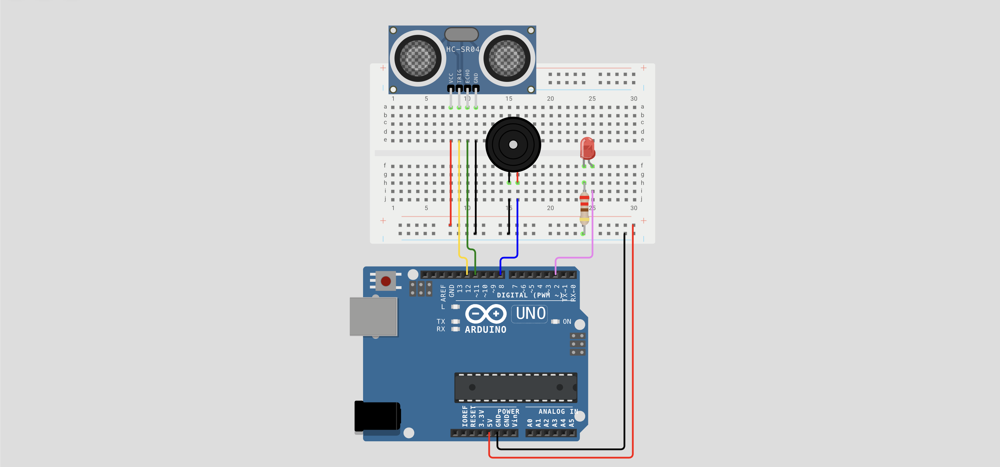

# 🚨 Lección 2: Alarma de Proximidad (Sensor de Parqueo)

Ya sabemos medir distancias. Ahora haremos que el robot **reaccione** a esa distancia.

Vamos a construir un sistema que nos avise si estamos demasiado cerca de un objeto, igual que el sensor de reversa de un coche. Si el obstáculo está lejos, silencio. Si está cerca, ¡ALARMA!

> **💡 Contexto Xplorer:** Este código es la base del sistema de "Evasión de Obstáculos". El robot avanzará felizmente hasta que su sensor le diga: *"¡Pared a 15cm!"*, entonces se detendrá y girará.

---

## 🎯 Objetivos de Aprendizaje

1.  **Lógica de Control:** Usar condicionales (`if / else`) basados en datos de sensores reales.
2.  **Integración:** Combinar Entrada (Sensor) con Salidas (Buzzer y LED).
3.  **Seguridad:** Definir una "Zona de Peligro" (Umbral).

## 🔌 Materiales y Conexión

Necesitamos conectar casi todo lo que hemos aprendido:
* 1 x Arduino Nano
* 1 x Sensor HC-SR04.
* 1 x Buzzer.
* 1 x LED + Resistencia.

### Diagrama de Conexión
* **Sensor Trig:** Pin **D12**.
* **Sensor Echo:** Pin **D11**.
* **Buzzer (+):** Pin **D8**.
* **LED (+):** Pin **D2**.
* **Todos los GND:** Unidos a Tierra.
* **Todos los VCC:** Unidos a 5V.

---

## 💻 Explicación del Código

El flujo del programa es:
1.  **Medir:** Obtener la distancia en centímetros.
2.  **Comparar:** ¿Es la distancia menor a 15 cm?
3.  **Actuar:**
    * **SÍ (Peligro):** Encender LED y sonar Buzzer.
    * **NO (Seguro):** Apagar todo.

El código usa la misma lógica de medición que la Lección 1, pero añade la toma de decisiones.

---

## 💾 Código Fuente: `02_Sensor_Parqueo.ino`

    /*
     * INSANI ROBOTICS - FUNDAMENTOS F7
     * Lección 2: Alarma de Proximidad
     * ------------------------------------------------
     * Objetivo: Activar alarma si un objeto está a menos de 15cm.
     */

    const int PIN_TRIG = 12;
    const int PIN_ECHO = 11;
    const int PIN_BUZZER = 8;
    const int PIN_LED = 2;

    // Distancia de seguridad (en cm)
    const int DISTANCIA_PELIGRO = 15;

    void setup() {
      Serial.begin(9600);
      pinMode(PIN_TRIG, OUTPUT);
      pinMode(PIN_ECHO, INPUT);
      pinMode(PIN_BUZZER, OUTPUT);
      pinMode(PIN_LED, OUTPUT);
    }

    void loop() {
      // 1. MEDIR DISTANCIA (Código estándar HC-SR04)
      digitalWrite(PIN_TRIG, LOW); delayMicroseconds(2);
      digitalWrite(PIN_TRIG, HIGH); delayMicroseconds(10);
      digitalWrite(PIN_TRIG, LOW);
      
      long duracion = pulseIn(PIN_ECHO, HIGH);
      int distancia = duracion * 0.0343 / 2;

      // Mostrar en pantalla para calibrar
      Serial.print("Distancia: ");
      Serial.println(distancia);

      // 2. TOMA DE DECISIONES
      // Si la distancia es válida (>0) Y es menor al peligro...
      if (distancia > 0 && distancia < DISTANCIA_PELIGRO) {
        
        // --- ZONA DE PELIGRO ---
        digitalWrite(PIN_LED, HIGH);  // Luz de alerta
        tone(PIN_BUZZER, 1000);       // Sonido continuo (1000Hz)
        
      } else {
        
        // --- ZONA SEGURA ---
        digitalWrite(PIN_LED, LOW);   // Luz apagada
        noTone(PIN_BUZZER);           // Silencio
      }

      delay(100); // Espera breve
    }

---

## 🤖 Asistente Docente (Prompt para IA)

Copia esto en Gemini:

> "Hola Gemini.
> 1. El código actual hace un sonido continuo. Ayúdame a modificarlo para que haga 'Beep-Beep-Beep' (intermitente) cuando esté cerca.
> 2. Propón un ejercicio de 'Semáforo de Distancia': Si está a >30cm (Verde), entre 10-30cm (Amarillo), <10cm (Rojo). ¿Qué necesitaría cambiar en el hardware y el código?
> 3. ¿Por qué a veces el sensor marca '0 cm' cuando no hay nada enfrente? (Explicación de fuera de rango)."

---

## 🚀 Reto para el Estudiante

**Misión:** "El Radar Proporcional"
En los coches, el pitido se hace más rápido cuanto más cerca estás.
**Reto Avanzado:** Intenta usar la función `map()` para cambiar la frecuencia del sonido según la distancia.
* 30 cm = Sonido grave (200 Hz).
* 5 cm = Sonido agudo (2000 Hz).

---

    <b>Insani Robotics</b> - <i>Fundamentos de Ingeniería</i>

