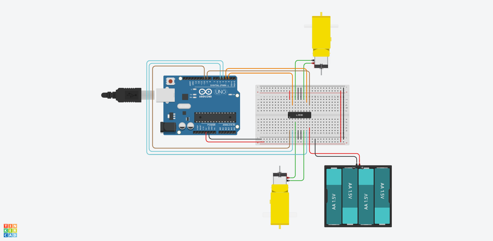

# 🏎️ Lección 2: Control de Velocidad (PWM)

Hasta ahora, conectábamos los pines `Enable` (las patas de las esquinas del L293D) directamente a 5V, lo que obligaba al motor a ir siempre a máxima potencia.

Ahora conectaremos esos pines a Arduino para usar **PWM (Modulación por Ancho de Pulso)**. Es la misma técnica que usamos para atenuar los LEDs en el Módulo F2.

> **💡 Contexto Xplorer:** Esto es vital para:
> 1.  **Tomar curvas suaves:** Una rueda gira un poco más lento que la otra.
> 2.  **Frenado progresivo:** Evitar que el robot vuelque al detenerse.
> 3.  **Ahorro de batería.**

---

## 🎯 Objetivos de Aprendizaje

1.  **Hardware:** Entender la función del Pin `Enable` en el Puente H (Es como la llave de paso del agua).
2.  **Programación:** Usar `analogWrite()` para controlar motores.
3.  **Física:** Relación entre Voltaje Promedio y Velocidad de giro (RPM).

## 🔌 Materiales y Conexión

La conexión es similar a la Lección 1, pero **añadimos dos cables más** para el control de velocidad.

* **Motor A (Izq):**
    * IN1 -> D2
    * IN2 -> D3
    * **EN1 (Velocidad) -> D9 (PWM)** <-- ¡NUEVO!
* **Motor B (Der):**
    * IN3 -> D4
    * IN4 -> D5
    * **EN2 (Velocidad) -> D10 (PWM)** <-- ¡NUEVO!

---

## 💻 Explicación del Código

Para mover el motor ahora necesitamos 3 instrucciones:
1.  Dirección (Adelante): `IN1 = HIGH`, `IN2 = LOW`.
2.  Velocidad (Potencia): `analogWrite(ENA, velocidad)`.

El valor de velocidad va de **0 (Parado)** a **255 (Turbo)**.

    // Ejemplo: Mover motor izquierdo al 50% de velocidad
    digitalWrite(2, HIGH);
    digitalWrite(3, LOW);
    analogWrite(9, 128); // 128 es la mitad de 255

---

## 💾 Código Fuente: `02_Control_Velocidad.ino`

    /*
     * INSANI ROBOTICS - FUNDAMENTOS F8
     * Lección 2: Acelerador Variable (PWM)
     * ------------------------------------------------
     * Objetivo: Controlar la velocidad de los motores.
     */

    // --- PINES ---
    // Motor A
    const int ENA = 9;  // Enable A (Debe ser PWM ~)
    const int IN1 = 2;
    const int IN2 = 3;

    // Motor B
    const int ENB = 10; // Enable B (Debe ser PWM ~)
    const int IN3 = 4;
    const int IN4 = 5;

    void setup() {
      // Todos salidas
      pinMode(ENA, OUTPUT); pinMode(IN1, OUTPUT); pinMode(IN2, OUTPUT);
      pinMode(ENB, OUTPUT); pinMode(IN3, OUTPUT); pinMode(IN4, OUTPUT);
    }

    void loop() {
      // 1. ACELERACIÓN SUAVE (0% a 100%)
      // Configuramos dirección hacia adelante
      digitalWrite(IN1, HIGH); digitalWrite(IN2, LOW);
      digitalWrite(IN3, HIGH); digitalWrite(IN4, LOW);

      // Subimos la velocidad poco a poco
      for (int i = 0; i < 256; i++) {
        analogWrite(ENA, i);
        analogWrite(ENB, i);
        delay(20);
      }

      delay(1000); // Mantener velocidad máxima

      // 2. FRENADO SUAVE (100% a 0%)
      for (int i = 255; i >= 0; i--) {
        analogWrite(ENA, i);
        analogWrite(ENB, i);
        delay(20);
      }
      
      // Parar completamente
      digitalWrite(IN1, LOW); digitalWrite(IN2, LOW);
      digitalWrite(IN3, LOW); digitalWrite(IN4, LOW);
      
      delay(2000);
    }

---

## 🤖 Asistente Docente (Prompt para IA)

Copia esto en Gemini:

> "Hola Gemini.
> 1. Explica qué es el PWM (Pulse Width Modulation) aplicado a un motor DC.  Usa la analogía de 'Empujar un columpio' muchas veces vs pocas veces.
> 2. ¿Por qué los motores suelen hacer un zumbido agudo cuando les pongo una velocidad muy baja (ej. 10 o 20) y no se mueven? (Torque inicial vs Fricción).
> 3. Crea un código para que el robot gire haciendo un círculo perfecto (Motor Izquierdo al 100%, Motor Derecho al 50%)."

---

## 🚀 Reto para el Estudiante

**Misión:** "Carrera de Resistencia"
Los motores nunca son idénticos. Aunque les des "255" a los dos, uno siempre correrá más que el otro y el robot se irá chueco.
**Reto:** Usa `analogWrite` con valores diferentes (ej. 255 en uno y 240 en el otro) para calibrar tu robot y lograr que avance en línea recta perfecta.

---

    <b>Insani Robotics</b> - <i>Fundamentos de Ingeniería</i>

