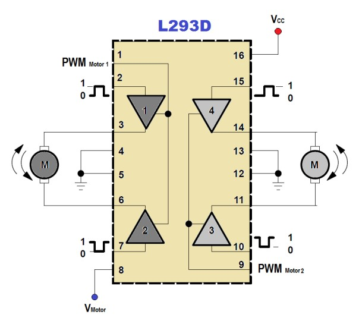

# ⚙️ Fundamento 8: Motores DC y Potencia (Driver L293D)

Los servomotores (F5) son precisos, pero lentos. Si queremos que nuestro robot corra, necesitamos **Motores de Corriente Continua (DC)**.

El problema es que estos motores consumen mucha energía (Corriente), mucha más de la que el Arduino puede dar. Por eso usamos un chip intermediario llamado **Puente H (L293D)**.

> **💡 Contexto Xplorer:**
> El L293D es el chip negro de 16 patas que ves en el centro de tu protoboard. Él se encarga de recibir las órdenes suaves del Arduino y soltar la fuerza bruta de las baterías hacia las ruedas.

---

## 📂 Índice de Lecciones

| Lección | Título | Concepto Principal | Dificultad |
| :--- | :--- | :--- | :---: |
| **[📂 Lección 1](./L1_Giro_y_Direccion)** | **Marchas (Adelante/Atrás)** | Entender la "Tabla de Verdad" lógica del Puente H. | ⭐⭐ |
| **[📂 Lección 2](./L2_Acelerador_Variable)** | **Acelerador (PWM)** | Controlar la velocidad usando el pin `Enable`. | ⭐⭐⭐ |

---

## 🛠️ Inventario del Módulo

* **1 x Arduino Nano**.
* **1 x Driver L293D** (Chip Puente H).
* **1 o 2 x Motores DC** (Caja reductora amarilla).
* **1 x Fuente de Energía Externa** (Portapilas 4xAA o Batería 9V).

### ⚠️ ADVERTENCIA DE SEGURIDAD (¡CRUCIAL!)
**NUNCA alimentes los motores directamente con los 5V del Arduino.**
1.  El Arduino se reiniciará (Brown-out) cada vez que el motor arranque.
2.  Puedes quemar el regulador de voltaje del Arduino permanentemente.
3.  **Solución:** Los motores deben tomar energía directamente de las baterías.

---

## ⚙️ Teoría: El Puente H (L293D)

El L293D funciona como un conjunto de interruptores digitales. Para controlar un motor necesitamos 3 pines del Arduino:

1.  **Input 1 (IN1):** Dirección A.
2.  **Input 2 (IN2):** Dirección B.
3.  **Enable 1 (EN1):** El pedal del acelerador (Velocidad).

### Tabla de Lógica
Para mover el motor, debemos combinar voltajes:

| Input 1 | Input 2 | Resultado |
| :---: | :---: | :--- |
| **HIGH** | LOW | **Giro Derecha (Adelante)** |
| LOW | **HIGH** | **Giro Izquierda (Atrás)** |
| LOW | LOW | **Motor Detenido (Punto Muerto)** |
| HIGH | HIGH | **ERROR (Corto de freno)** |

*(Sube la imagen que me pasaste al inicio: `Conexion_4_1_logica_L293D.png` con este nombre)*

---

## 🤖 Guía para el Docente (IA)

Prompt para explicar electrónica de potencia:

> **Copia y pega esto:**
> "Actúa como ingeniero eléctrico. Voy a enseñar sobre el Puente H (L293D).
> 1. Explica la analogía de 'Las compuertas de una presa' para entender por qué usamos un chip para controlar la corriente de las baterías. (Arduino es el operador de la compuerta, el agua es la corriente).
> 2. ¿Qué es la fuerza contraelectromotriz (Back EMF) y por qué el L293D tiene diodos de protección internos?
> 3. Genera un esquema de conexión seguro para alimentar Arduino y Motores con la misma batería de 9V (Pin Vin vs Pin 5V)."

---

    <b>Insani Robotics</b> - <i>"Potencia bajo control"</i>

